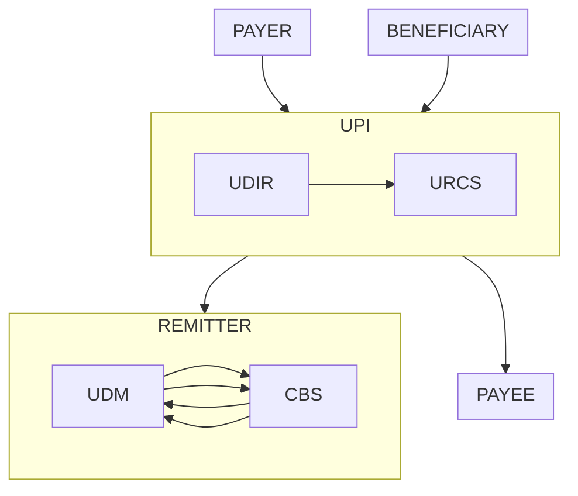

1. **Debit Reversal Done Online (DRC 102)**: The Remitter bank checks and confirms that the debit reversal was successfully done online.
    
2. **Debit Reversal Not Done, but Done Now (DRC 103)**: The Remitter bank checks and confirms that the debit reversal was not done initially but is being done now.
    
3. **Debit Not Done During Transaction (DRC 104)**: The Remitter bank checks and confirms that no debit occurred during the transaction.
    
4. **Manual Debit Reversal (DRC UT1-6)**: The Remitter bank determines that manual intervention is required for debit reversal and responds with specific codes (UT1, UT2, UT3, UT4, UT5, UT6) indicating the reason or status for the manual process.

# EXC
- write a note
- show note
